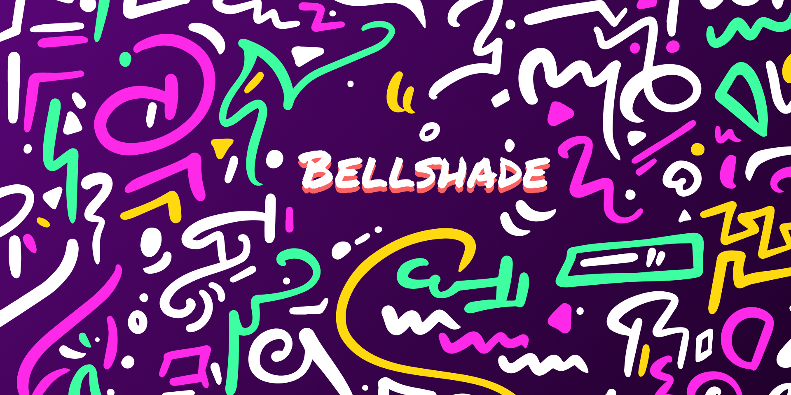

    <!-- badge koding assembly-->
     
<!--      -->
    <!-- badge discord-->
    <a href="http://discord.gg/S4rrXQU">
    <!-- baddge sponsor-->
    

## Tentang Bellshade
Bellshade adalah organisasi yang bergerak di bidang edukasi dan bersifat sumber terbuka (open source). Bellshade dikelola dan berada di bawah naungan komunitas [Web Programming UNPAS (WPU)](http://discord.gg/S4rrXQU).
 
Nama Bellshade sendiri diambil dari bahasa Inggris yang berarti "_penutup lampu belajar_", yang mengarahkan cahaya dari lampu agar fokus pada tujuan dan tepat sasaran. Dengan nama ini, Bellshade diharapkan dapat menjadi wadah untuk menerangi dan mengarahkan serta memberikan ilmu kepada orang yang membutuhkan, terutama di bidang teknologi.

<b>Bekerja sama dengan</b>

 
<ul>
    <li>
        <b><a href="https://www.youtube.com/kelasterbuka">Kelas Terbuka</a></b>
        
 
            <b>Kelas Terbuka</b> adalah kanal YouTube yang memberikan media pembelajaran pemrograman secara umum dan teknik komputasi serta pengolahan data secara             khusus dari dasar hingga menengah.
             
            Owner Kelas Terbuka: <a href="https://github.com/faqihza">Faqihza Mukhlish</a>
             
            Organisasi (GitHub): <a href="https://github.com/kelasterbuka">Kelas Terbuka</a>
        

    </li>

<!-- informasi metrics -->
<!--  -->
<!-- <imga alt="metrics" src="informasi1.png"> -->
